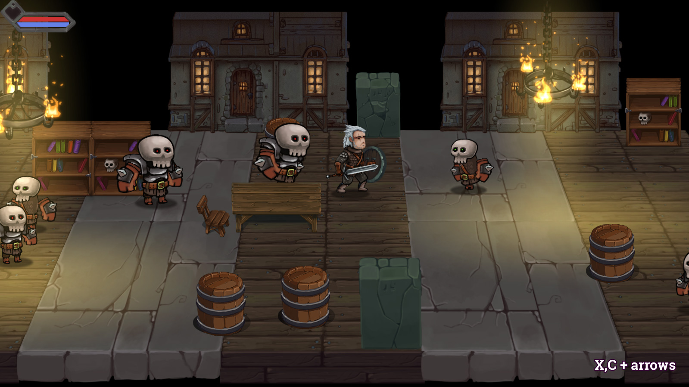

# slasher-prototype
Game prototype. 2.5D perspective view. Levels loader, the hero controller, monsters and basic AI logic.
Gamepad and keyboard binding supported.
LUA. Defold engine.

## HTML5 demo
Try here: [demo](https://dragosha.github.io/slasher-prototype/)

**Used dependencies:**
* Defold-input (by britzl)
* Rendercam (by rgrams)
* ludobits (by britzl)

## Art and animations license:

CC0 1.0 Universal
You’re free to use these assets in any project, personal or commercial. There’s no need to ask permission before using these. Giving attribution is not required, but is greatly appreciated! 
