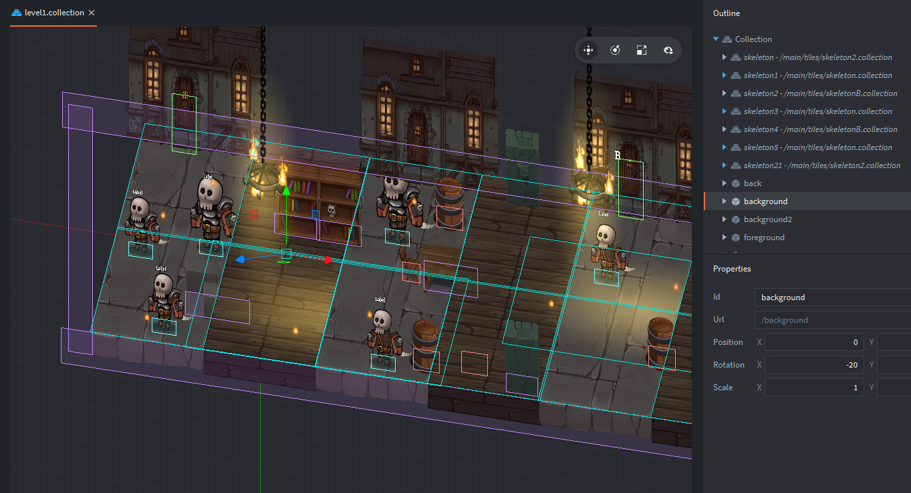
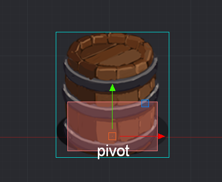
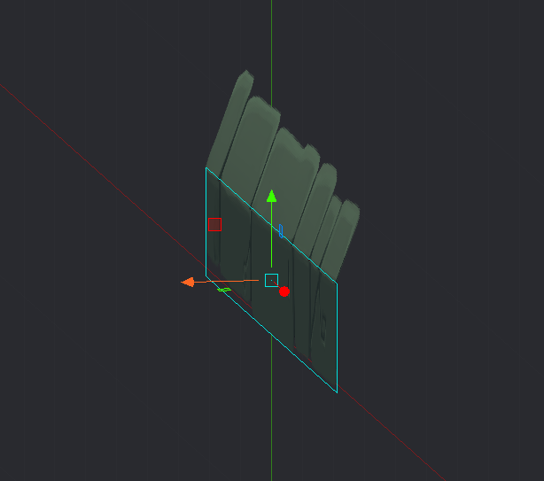

# slasher-prototype
Game prototype. 2.5D perspective view. Levels loader, the hero controller, monsters and basic AI logic.
Gamepad and keyboard binding supported.
LUA. Defold engine.

## HTML5 demo
Try here: [demo](https://dragosha.github.io/slasher-prototype/)


> [!WARNING]
> Please update 'Spine extension' dependence to [actual version](https://github.com/defold/extension-spine/releases) before open the project in Defold editor. To make this: open `game.project` file in any text editor and change the path `dependencies#3 = https://github.com/defold/extension-spine/archive/refs/tags/3.8.3.zip` depending on the version of your Defold editor.


## Code
**Used dependencies:**
* Defold-input (by britzl)
* Rendercam (by rgrams)
* ludobits (by britzl)

## Level design

tip: use ```Ctrl(cmd)+LeftMouse``` to rotate camera in the editor.

Notice: Y-coordinate of gameobject used as pivot for auto-correction Z-coordinate for perspective view of scene. See: scene.script > load_complete function.



**Composite object:**


- contains 2 sprite component, one for a front plane, second for a top plane with rotating around X-axe


## Art and animations license:

CC0 1.0 Universal
You’re free to use these assets in any project, personal or commercial. There’s no need to ask permission before using these. Giving attribution is not required, but is greatly appreciated! 
